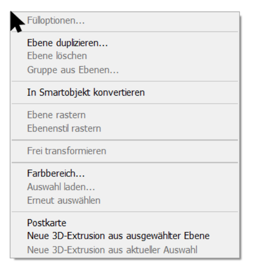

= Context Menu
Lydia Reiter
1.0.0, 2021-12-21
//:toc-placement!:  // prevents the generation of the doc at this position, so it can be printed afterwards
:sourcedir: ../src/main/java
:icons: font
:sectnums:    // Nummerierung der Überschriften / section numbering
:toc: left

//Need this blank line after ifdef, don't know why...
ifdef::backend-html5[]

// print the toc here (not at the default position)
//toc::[]

== Allgemein

=== Verbindung mit Alltag

App rechtsklick für mehr Aktionen

.Bps: Photoshop

== Demo

.Code
[source,java]
----
class Demo{
    public void start(Stage stage) throws IOException {
        ContextMenu contextMenu = new ContextMenu();
        MenuItem menuItem1 = new MenuItem("Choice 1");
        MenuItem menuItem2 = new MenuItem("Choice 2");
        MenuItem menuItem3 = new MenuItem("Choice 3");
        Label ausgabe = new Label();

        menuItem3.setOnAction((event) -> {
            ausgabe.setText("menuItem3");
        });

        menuItem2.setOnAction((event) -> {
            ausgabe.setText("menuItem2");
        });

        menuItem1.setOnAction((event) -> {
            ausgabe.setText("menuItem1");
        });

        contextMenu.getItems().addAll(menuItem1,menuItem2,menuItem3);

        TextArea textArea = new TextArea();

        textArea.setContextMenu(contextMenu);

        VBox vBox = new VBox(textArea, ausgabe);

        Scene scene = new Scene(vBox);
        stage.setTitle("Hello!");
        stage.setScene(scene);
        stage.show();
    }
}
----

.Ausgabe
video::video/demo.mp4[width=500]